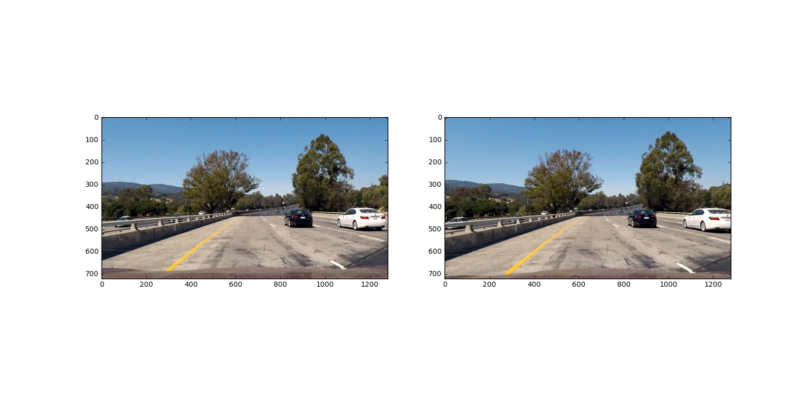
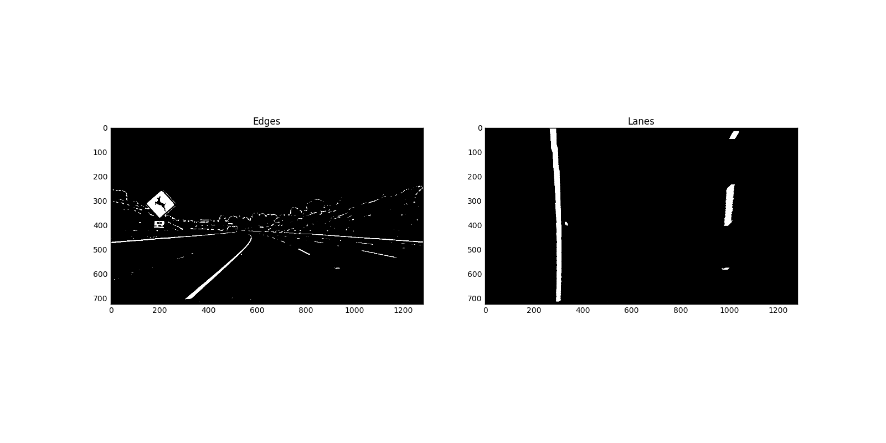

## Advanced Lane Finding
[](http://www.udacity.com/drive)


**Advanced Lane Finding Project**

The goals / steps of this project are the following:

* Compute the camera calibration matrix and distortion coefficients given a set of chessboard images. - Done
* Apply a distortion correction to raw images. - Done
* Use color transforms, gradients, etc., to create a thresholded binary image.  - Done
* Apply a perspective transform to rectify binary image ("birds-eye view").  - Done
* Detect lane pixels and fit to find the lane boundary. - Done
* Determine the curvature of the lane and vehicle position with respect to center. - Done
* Warp the detected lane boundaries back onto the original image. - Done
* Output visual display of the lane boundaries and numerical estimation of lane curvature and vehicle position. - Done


[//]: # (Image References)

[image1]: ./examples/undistort_output.png "Undistorted"
[image2]: ./test_images/test1.jpg "Road Transformed"
[image3]: ./examples/binary_combo_example.jpg "Binary Example"
[image4]: ./examples/warped_straight_lines.jpg "Warp Example"
[image5]: ./examples/color_fit_lines.jpg "Fit Visual"
[image6]: ./examples/example_output.jpg "Output"
[video1]: ./project_video.mp4 "Video"


## [Rubric](https://review.udacity.com/#!/rubrics/571/view) Points
### Here I will consider the rubric points individually and describe how I addressed each point in my implementation.  

---
###Writeup / README

####1. Provide a Writeup / README that includes all the rubric points and how you addressed each one.  You can submit your writeup as markdown or pdf.  [Here](https://github.com/udacity/CarND-Advanced-Lane-Lines/blob/master/writeup_template.md) is a template writeup for this project you can use as a guide and a starting point.  

You're reading it!
###Camera Calibration

####1. Briefly state how you computed the camera matrix and distortion coefficients. Provide an example of a distortion corrected calibration image.

First I created two help functions in cell #3 of `Main.ipynb` or lines #32 through #50 in `Main.py`.
* `load_imgs` loads all the images given the path and returns them in an array. 
* `plot_imgs` draws the supplied in an array images using subplots and also saves them to a file.
* Then in the same cell #3 or lines #50 to #70 is defined the `calc_undistort(imgs)` function, which accepts the calibration images. Converts them to grayscale and uses the `cv2.findChessboardCorners`, `cv2.drawChessboardCorners`, and `cv2.calibrateCamera` to find the camera matrix and distortion coefficients. Finally I use `cv2.undistort` to undistort the supplied images. All the code is executed in the following cell #4 or line numbers #75 through #80.

You can see the undistorded callibration images in the following image:
 Fig.1: Undistorted calibration images

Then the image with the found crosses in the chess boards:

 Fig.2: Found crosses in the chess boards

And finally the original and undistorted images:
 Fig.3: Original and undistorted images


###Pipeline (single images)

####1. Provide an example of a distortion-corrected image.

The images from the camera are undistorted using the camera calibration matrix and distortion coefficients computed in the previous step. This is done using the `cv2.undistort` function called as in my function in cell #5 (lines #86 to #88) shown below:
```
def undistort_img(img, mtx, dist):
    undist = cv2.undistort(img, mtx, dist, None, mtx) 
    return undist
```

An example of an image before and after the distortion correction procedure is shown below.
 Fig.4: Test image 1 original and undistorted
It's vissible how the white car in the right side is moved a bit in the undistorted image.

####2. Describe how (and identify where in your code) you used color transforms, gradients or other methods to create a thresholded binary image.  Provide an example of a binary image result.

Initially a number of combinations of color and gradient thresholds were attempted. It was found that none of these were very robust to changing conditions in lighting and contrast. After lots of experimentation and some literature review on the subject, it was found that using a second derivative operation (Laplacian) might be more suited to this purpose. By using a Laplacian filter (using `cv2.Laplacian`) on the image followed by thresholding it to highlight only the negative values (denoting a dark-bright-dark edge) it was possible to reject many of the false positives. The Laplacian resulted in better results than using combinations of Sobel gradients.

The thresholding operations used to detect edges in the images can be found in cell #9 lines #156-185 in the function called `find_edges`. The thresholded binary mask obtained from the Laplacian is named mask_one in the code. The thresholding is first performed on the S-channel of the image in HLS colorspace. If too few pixels were detected by this method (less than 1% of total number of pixels), then the Laplacian thresholding is attempted on the grayscale image.

The second thresholded mask, `mask_two`, is created using a simple threshold on the S-channel. And finally, a brightness mask `gray_binary` is used to reject any darker lines in the final result. These masks are combined as: `combined_binary = np.clip(cv2.bitwise_and(gray_binary, cv2.bitwise_or(mask_three, mask_two)), 0, 1).astype('uint8')`

The results obtained using the edge detection algorithm for images is shown below:
 Fig.5: edges detected and lanes perspective, image 1
 Fig.6: edges detected and lanes perspective, image 2
 Fig.7: edges detected and lanes perspective, image 3
 Fig.8: edges detected and lanes perspective, image 4
 Fig.9: edges detected and lanes perspective, image 5
 Fig.10: edges detected and lanes perspective, image 6

####3. Describe how (and identify where in your code) you performed a perspective transform and provide an example of a transformed image.
The perspective transformation is computed using the functions `find_perspective_points` and `get_perspective_transform` in cell #9 lines #127 to #154 and #187 to #244. `find_perspective_points` uses the method from P1 to detect lane lines. Since the lanes are approximated as lines, it can be used to extract four points that are actually on the road which can then be used as the "source" points for a perspective transform.

Here is a brief description of how ths works:

Perform thresholding/edge detection on the input image
Mask out the upper 60% of pixels to remove any distracting features
Use Hough transforms to detect the left and right lane markers
Find the apex-point where the two lines intersect. Choose a point a little below that point to form a trapezoid with four points -- two base points of lane markers + upper points of trapezoid
Pass these points along with a hardcoded set of destination points to `cv2.getPerspectiveTransform` to compute the perspective transformation matrix
Note: In case the hough transform fails to detect the lane markers, a hardcoded set of source points are used

I verified that my perspective transform was working as expected by drawing the `src` and `dst` using a quadrangle points onto a test image and its warped counterpart to verify that the lines appear parallel in the warped image. The original and warped images along with the source points (computed dynamically) and destination points used to computed the perspective transform, are shown below:

 Fig.11: bird view - perspective transform, image 1
 Fig.12: bird view - perspective transform, image 2
 Fig.13: bird view - perspective transform, image 3
 Fig.14: bird view - perspective transform, image 4
 Fig.15: bird view - perspective transform, image 5
 Fig.16: bird view - perspective transform, image 6


####4. Describe how (and identify where in your code) you identified lane-line pixels and fit their positions with a polynomial?

The lane detection was primarily performed using two methods -- histogram method and masking method. The latter only works when we have some prior knowledge about the location of the lane lines. A sanity check based on the radius of curvature of the lanes is used to assess the results of lane detection. If two many frames fail the sanity check, the algorithm reverts to the histogram method until the lane is detected again.

Both methods also use a sanity check which checks if the radius of curvature of the lanes have changed too much from the previous frame. If the sanity check fails, the frame is considered to be a "dropped frame" and the previously calculated lane curve is used. If more than 16 dropped frames are consecutively encountered, the algorithm switches back to the histogram method.

* Histogram Method

The first step in this method is to compute the base points of the lanes. This is done in the `find_base_points` function in cell #18 lines #710 - #723. The first step is to compute a histogram of the lower half of the thresholded image. The histogram corresponding to the thresholded, warped image in the previous section is shown below:

 Fig.17: The histogram corresponding to the thresholded and warped image 

The `find_peaks_cwt` function from the `scipy.signal` is used to identify the peaks in the histogram. The indices thus obtained are further filtered to reject any below a certain minimum value as well as any peaks very close to the edges of the image. For the histogram shown above, the base points for the lanes are found to be at the points 297 and 1000.

Once the base points are found, a sliding window method is used to extract the lane pixels. This can be seen in the `histogram_lane_detection` function in cell #17 lines #665 to #703. The algorithm splits the image into a number of horizontal bands (10 by default). Starting at the lowest band, a window of a fixed width (20% of image width) centered at both base points is considered. The x and y coordinates of all the nonzero pixels in these windows are compiled into into separate lists. The base point for the next band is assumed to be the column with the maximum number of pixels in the current band. After all the points are accumulated, the function reject_outliers is used to remove any points whose x or y coordinates are outside of two standard deviations from the mean value. This helps remove irrelevant pixels from the data.

The filtered pixels are then passed into the `add_lane_pixels` method of the Lane class defined in cell #17 lines #567 to 612. These pixels, along with a weighted average of prior lane pixels are used with `np.polyfit` to compute a second order polynomial that fits the points.

The polynomial is then used to create an image mask that describes a region of interest which is then used by the masking method in upcoming frames.

* Masking Method

This is the less computationally expensive procedure that is used when a lane has already been detected before. The previously detected lanes are used to define regions of interest where the lanes are likely to be in (shown in image above). This is implemented in the `detect_from_mask` method defined in cell #17 lines 639-646. The algorithm uses the mask generated during the histogram method to remove irrelevant pixels and then uses all non-zero pixels found in the region of interest with the `add_lane_pixels` method to compute the polynomial describing the lane.

* Sanity check

The sanity check is defined in the method `sanity_check_lane` in lines #622 to #636. It is called by the `add_lane_pixels` method regardless of what method is used to detect the lane pixels. The stored value of the radius of curvature of the lane is used to see if the current radius of curvature has deviated by more than 50% in which case.
``` 
R0 = self.radius_of_curvature
self.insanity = abs(R-R0)/R0  # R = current radius of curvature
return self.insanity <= 0.5
```

####5. Describe how (and identify where in your code) you calculated the radius of curvature of the lane and the position of the vehicle with respect to center.

The radius of curvature is computed in the `compute_rad_curv` method of the Lane class in cell #17 lines #615-619. The pixel values of the lane are scaled into meters using the scaling factors defined as follows:
```
ym_per_pix = 30/720 # meters per pixel in y dimension
xm_per_pix = 3.7/700 # meteres per pixel in x dimension
```

These values are then used to compute the polynomial coefficients in meters and then the formula given in the lectures is used to compute the radius of curvature.

The position of the vehicle is computed by the code in cell #20 lines #840 to #845. The camera is assumed to be centered in the vehicle and checks how far the midpoint of the two lanes is from the center of the image.
```
middle = (left_fitx[-1] + right_fitx[-1])//2
veh_pos = image.shape[1]//2
dx = (veh_pos - middle)*xm_per_pix # Positive on right, Negative on left
```

####6. Provide an example image of your result plotted back down onto the road such that the lane area is identified clearly.

The complete pipeline is defined in the process_image function in cell #20 lines #748 to #872 that performs all these steps and then draws the lanes as well as the radius and position information on to the frame. The steps in the algorithm are:

Distortion correction → Edge Detection → Perspective Transform → Lane Detection (using Histogram or Masking methods) → Sanity Check


 Fig.18: Processed image

---

###Pipeline (video)

####1. Provide a link to your final video output.  Your pipeline should perform reasonably well on the entire project video (wobbly lines are ok but no catastrophic failures that would cause the car to drive off the road!).

Here's a [link to my video result](./project_video_out.mp4)

####2. Challenge video output

Here's a [link to my video result](./challenge_video_out.mp4)
The algorithm has to be improved and made more robust for that video.


---

###Discussion

####1. Briefly discuss any problems / issues you faced in your implementation of this project.  Where will your pipeline likely fail?  What could you do to make it more robust?

The pipeline was able to detect and track the lanes reliably in the project video. With some tweaks (reversing the warping/edge detection), it also worked well for the challenge video. The main issue with the challenge video was lack of contrast and false lines.